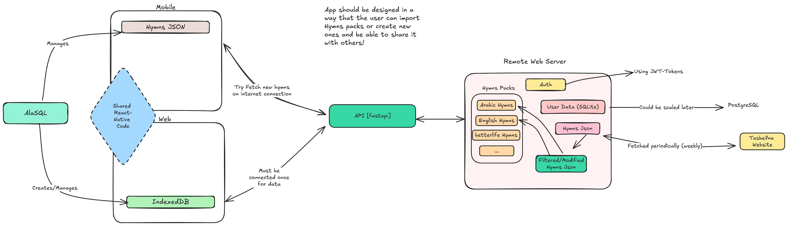

# About

Hymnos is an app that enable Church services to present Hymns or any Liturgical text during praying. It is designed to be cross-platform and built with [React-Native (expo)](https://expo.dev/).

# Usage

Make sure you have Python, Nodejs and npm install on your system. Please refer to [NodeJs](https://www.npmjs.com/) and [Python](https://www.python.org/)

## Frontend

- Go inside the `frontend/` folder using `cd frontend/`.
- Run `npm install`.
- Run `npx expo start`.
- Navigate to `localhost:8081` to see the app. You can also install the [Expo Go](https://expo.dev/go) app on your mobile and scan the QR code you see on the terminal to run the app.

### Technologies used

- [**zustand**](https://github.com/pmndrs/zustand): global state managment.
- [**expo-fonts**](https://docs.expo.dev/versions/latest/sdk/font/): utilizing Google fonts inside the app.
- [**nativewind**](https://www.nativewind.dev/): cross-platform styling using [tailwindcss](https://tailwindcss.com/).
- [**alasql**](https://github.com/AlaSQL/alasql): javascript database that could be used in a cross-platform way.

## Backend

Backend is built using Python and [fastapi](https://fastapi.tiangolo.com/) for designing a simple API.

- Create a new virtual environment using `python -m venv venv` inside your `backend/` folder.
- Activate the venv using `source venv/bin/activate` for linux. For windows run `.\venv\Scripts\activate`.
- Install the dependencies using `pip install -r requirements.txt`
- Serve the backend API using `fastapi dev src/main.py`.
- In your browser navigate to `http://127.0.0.1:8000/docs` for the Swagger docs.

# Architecture

